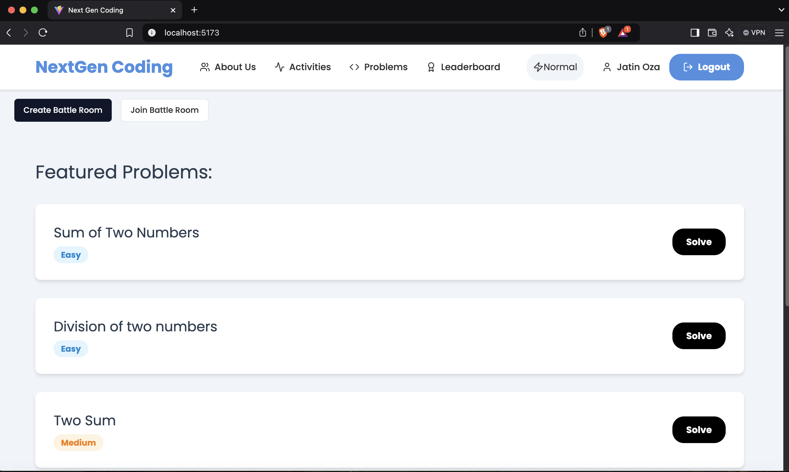
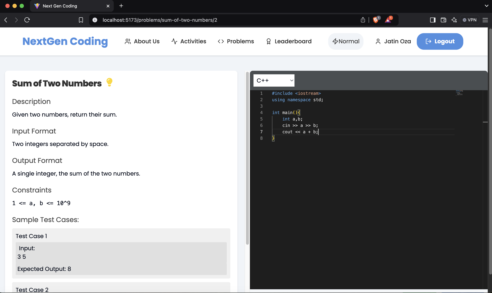
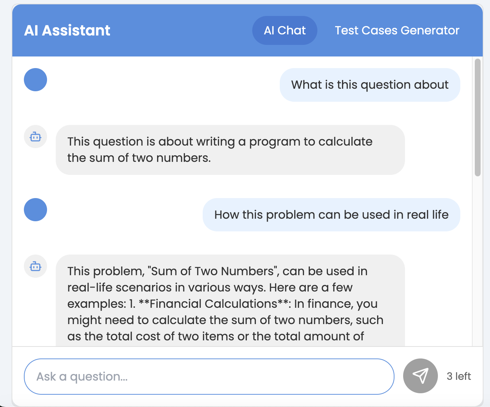
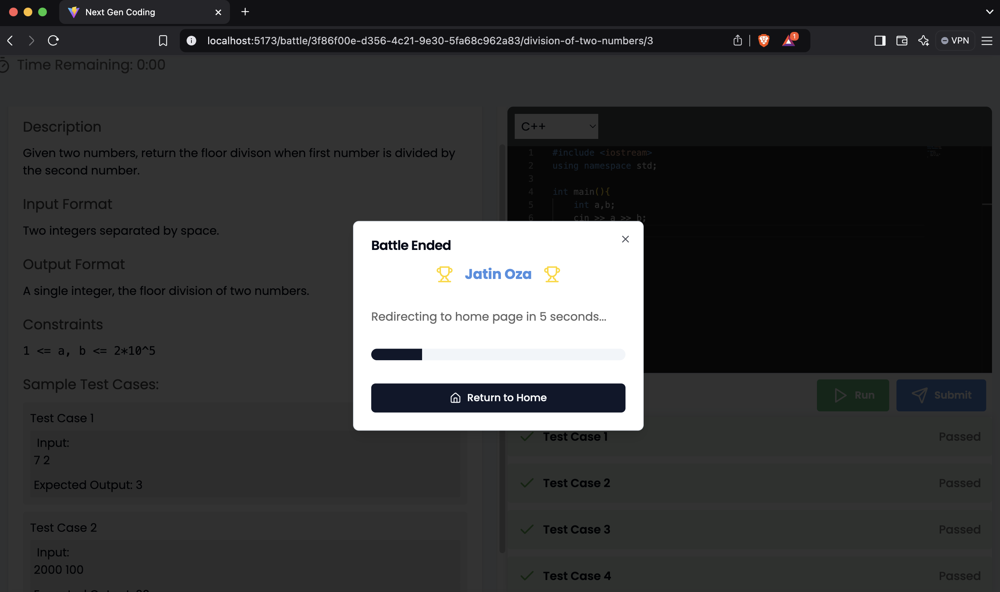

# **NextGen Coding**

## **Project Overview**  

The **NextGen Coding Platform** is an AI-powered coding platform developed using the **MERN stack**. It provides a seamless environment for solving coding problems, evaluating solutions in real time, and enhancing coding skills. This platform also features a **Pro Mode** with AI-driven optimizations, competitive Battle Rooms, and advanced coding analysis to engage users and improve their solutions effectively.

---

## **Key Features**

1. **Google Authentication**  
   - Easy social login using **Auth0** and Google accounts.  
   - New users are automatically onboarded.

2. **Dynamic Problem Listings**  
   - Problems are fetched dynamically from the backend.  
   - A green tick ✅ indicates solved problems.

3. **Real-Time Code Execution**  
   - Integrated **Monaco Editor** for a rich coding experience.  
   - **Run** operation validates code against visible test cases.  
   - **Submit** executes code against hidden and visible test cases.

4. **AI-Powered Code Analysis**  
   - After successful submission, the platform provides:  
     - **Time Complexity** and **Space Complexity** reports.  

5. **User Activity History**  
   - Displays the last **15 submissions** with detailed results.

6. **Battle Room** (Competitive Coding)  
   - Real-time coding battles between friends using **WebSockets**.  
   - Random questions are assigned; the player solving the most questions wins.

7. **Pro Mode Features**  
   - AI-driven suggestions for improving code efficiency.  
   - AI-based test case generation for custom inputs.  

---

## **Tech Stack**

| **Technology**       | **Purpose**                     |
|-----------------------|---------------------------------|
| MongoDB               | Database                       |
| Express.js            | Backend API Framework          |
| React.js              | Frontend UI Library            |
| Node.js               | Backend Server Environment     |
| Styled Components     | Component-level Styling        |
| WebSockets            | Real-time Battle Room Feature  |
| Auth0                 | Social Login Integration       |
| Judge0 API            | Code Execution Engine          |
| Vercel                | Deployment Platform            |

---

## **Screenshots**  

| **Home Page**                  | **Problem Page**                  |
|--------------------------------|----------------------------------|
|   |  |

| **AI Chat Assistant**                  | **Battle Room**                  |
|--------------------------------------|---------------------------------|
|  |  |

---
